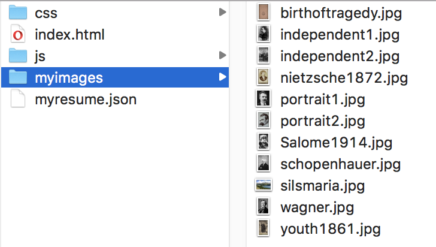
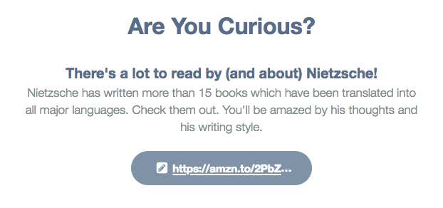

# myresume.json Reference
A My Résumé is built from two parts:

* a data file with all the descriptive text and links in it; that file is called `myresume.json` and it has to sit next to the `index.html` file.
* any images you'd like to add; it's suggested to put them all in folder (maybe called `myimages`) next to `myresume.json`.

Here's an example for the resulting file/folder structure on your hard disk:

And once you move this file/folder structure to your web server the `index.html` file can be served when you point a browser to it. That's what happens when you open the demo My Résumé at [https://myresume-nietzsche.now.sh](https://myresume-nietzsche.now.sh)

This should be pretty easy - except for the `myresume.json`. My Résumé is free and hence does not sport and fancy tool to enter and edit your data. Instead you need to edit the JSON data in `myresume.json` with a plain text editor like Windows' Notepad or some JSON syntax aware editor like [Sublime](https://www.sublimetext.com) or [VS Code](https://code.visualstudio.com) or with a full fledged JSON editor like [this](https://jsonformatter.org/json-editor).

It's up to you. But you have to ensure to stick to the schema described below:

## Schema
### Overall structure
A `myresume.json` consists of three main parts:

* `personaldata` for, well, your personal data including your work history
* `classifiedads` for whatever you want to "sell" in addition
* `getintouch` for the final "call to action" and a link to a contact page (or your email address)

In addition there is a title image (`titleimage`) you should define to be displayed on top of your personal data. Make it large enough to be strechted nicely across the page, eg. at least 1024 pixels wide.

The title image as all images needs to be referenced from the file/folder structure with a local/relative filename staring from where the `myresume.json` file sits.

The `themecolor` property defines the basic color from which the color for graphic elements in the work history and timeline are derived. You can use color charts like [this](https://www.w3schools.com/colors/colors_names.asp) or [this](https://html-color-codes.info) to find a color that suits you. Just be sure to enter a color value as a hex number with a `#` in front of it. (You can try color names like `Coral`, but numbers let you finetune your color.)

### personaldata
The personal data section again is structured:

There is data about your person, a list of social media accounts you can be reached at, and all the details of your work history.

#### Personal data
The image you provide will be rendered inside a circle. See to that your face (or whatever you want to display) sits at the center of it.

All other data will be drawn below the image. With the `shortbio` you can briefly describe what you do, what your vision is, or just make a global statement about your person.

You might be tempted to structure such longer texts with line breaks using `\n`. At this point, though, this does not work. Line breaks won't show up in the rendered page.

#### socialmedia
#### workhistory

### classifiedads
### getintouch
The section for your contact info is the most simple and shortest one:

Check out how this renders:

There is a section headline (`caption`), a sub-headline or call to action (`title`), and a description to elaborate on what the benefits are of clicking the button - which opens the page given by the `url`.

If you enter `email` as the value for `mode`, then the `url` is prefixed with `mailto:` and the email client of the user will open upon button click. Any other `mode` value will lead to the `url` being interpreted as a link to a web page which will be opened in another browser tab.

